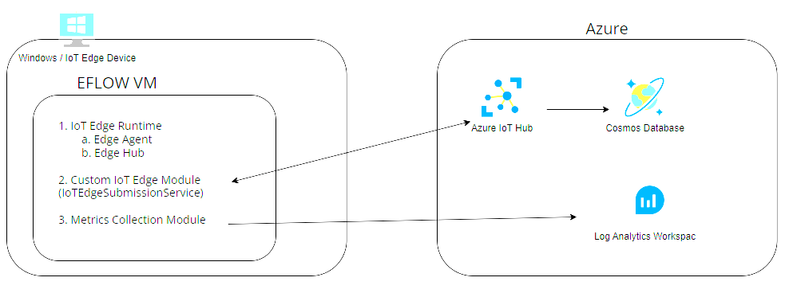

# IoT Edge Web API Sample Project

## Overview

This sample project contains the Azure and Edge components necessary to host a Web API on the edge that accepts valid JSON and forwards it to IoT Hub in Azure. IoT Hub in turns sends the data to Cosmos Database. The components that run on the edge are hosted on a Windows device configured with EFLOW to host the IoT Edge runtime, and custom modules to host a web api for json submission, and a module for sending additional metrics to Log Anatlycs for observability. 

Clone this repo and follow the steps below to get the solution running in your own Azure subscription.

## Deploy Azure Infrastructure

Using a bicep file and the Azure CLI, you can deploy the Azure services as visualized below.  This includes...
1. [Azure IoT Hub](https://azure.microsoft.com/en-us/products/iot-hub/)
2. [Azure Cosmos Database](https://azure.microsoft.com/en-us/products/cosmos-db/)
3. [Azure Log Analytics Workspace - part of Azure Monitor](https://azure.microsoft.com/en-us/products/monitor/)




The Edge components that run outside of Azure include..
1. A Windows Server or Client.
2. [EFLOW](https://learn.microsoft.com/en-us/azure/iot-edge/iot-edge-for-linux-on-windows?view=iotedge-1.4) (Azure IoT Edge for Linux on Windows).
3. Custom C# modules to host a local web API and collect metrics for observability.
### To Deploy Azure Infrasructure
After cloning this repo locally, navigate to the [BicepDeployment Directory](..BicepDeployment/) and execute the following commands.  
```C#	
// You must first authenticate with Azure.
az login

// use az account set if you need to set the active subscription
az account set -s <subscription id here>

// Create a resource group for all Azure resources related to this project
// use az account list-locations for list of Azure regions
az group create -n <new resource group name> -l <desired Azure region>

// deploy main.bicep file to the resource group you just created
az deployment group create --resource-group <resource-group-name> --template-file main.bicep
```

## Install  Edge Components

1. [Install and configure EFLOW VM on Windows device](https://learn.microsoft.com/en-us/azure/iot-edge/how-to-provision-single-device-linux-on-windows-symmetric?view=iotedge-1.4&tabs=azure-portal)

## Build custom modules and push to a container registry

1. Once [The EdgeTicketSubmissionModule](./EdgeTicketSubmissionModule/) is build and pushed to a container registry, follow these instructions on [How to deploy IoT Edge Modules](https://learn.microsoft.com/en-us/azure/iot-edge/how-to-deploy-modules-portal?view=iotedge-1.4).


## Test Web API hosted on IoT Edge device
